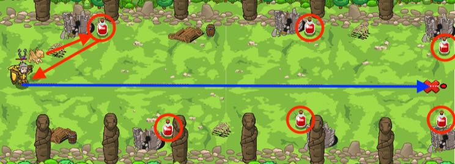

## _Long Road_

#### _Legend says:_
> Drinking unknown potions can be useful, especially in an ogre forest.

#### _Goals:_
+ _Move to the right_

#### _Topics:_
+ **Basic Syntax**
+ **Strings**
+ **Variables**
+ **While Loops**
+ **If Statement**
+ **Functions**

#### _Items we've got (- or need):_
+ Pet

#### _Solutions:_
+ **[JavaScript](longRoad.js)**
+ **[Python](long_road.py)**

#### _Rewards:_
+ 75 xp
+ 45 gems

#### _Victory words:_
+ _SHAMAN POTIONS ARE NUTRITIOUS AND DELICIOUS!_

___

### _HINTS_

You must escape this ogre trap while poisoned and slowed! Luckily you have your faithful pet to help!



Move to the right, while your pet fetches potions for you. Use `pet.fetch(item)` to carry the potions back to the hero.

You've learnt how to use pet's events in previous levels. If you have problems with this level, then try to return and refresh your skills.

Don't forget to assing an event handler for the certain event:

```javascript
function onSpawn(event) {
    pet.say("First Frame!");
}

// It should be outside of the function
pet.on("spawn", onSpawn);
```

___
