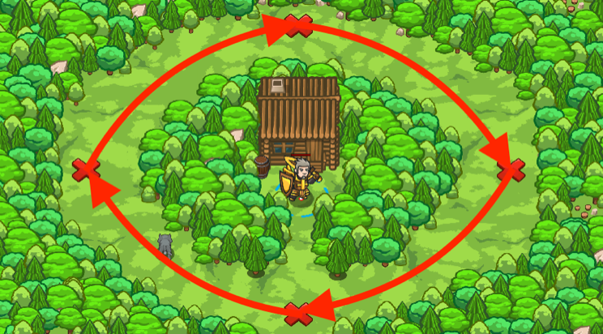

## _Forest Jogging_

#### _Legend says:_
> What is better than a morning jog? Especially, if someone else does it.

#### _Goals:_
+ _The pet must complete the 1st lap_
+ _The pet must complete the 2nd lap_
+ _The pet must complete the 3rd lap_
+ _Cheer on your pet_

#### _Topics:_
+ **Basic Syntax**
+ **Arguments**
+ **Strings**
+ **While Loops**
+ **Functions**

#### _Items we've got (- or need):_
+ Pet
+ _Optional: Brown Rat (super fast)_

#### _Solutions:_
+ **[JavaScript](forestLogging.js)**
+ **[Python](forest_logging.py "#1 - 20.7s")**

#### _Rewards:_
+ 75 xp
+ 45 gems

#### _Victory words:_
+ _WHAT A GOOD WORKOUT! GOOD JOB, YOU._

___

### _HINTS_



Pets can perform actions independently from the hero.

For example, your pet can move around while your hero is speaking.

Use `pet.moveXY()` in the `onSpawn` function. Then assign `onSpawn` as the **event handler function** for the `"spawn"` **event**

Don't forget to use `while-true` loop inside `onSpawn` function. Otherwise your pet will run only one lap.

```javascript
function onSpawn(event) {
    while (true) {
        pet.moveXY(9, 24);
        // ...
    }
}
```

When you assign `onSpawn` for the `"spawn"` event, it's important that `"spawn"` is a string and `onSpawn` is a reference (variable name) for the function.

___
