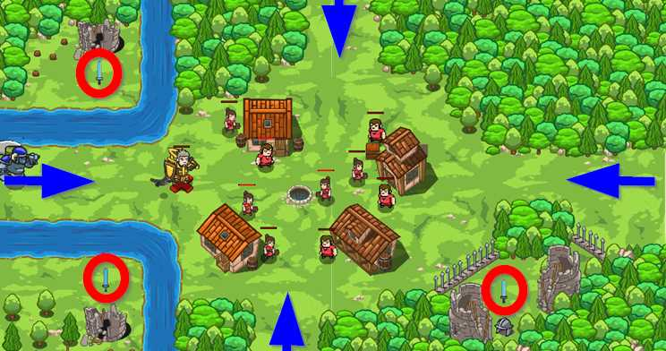

## _Airdrop_

#### _Legend says:_
> Our airborn deliver service is ready to help you against ogres.

#### _Goals:_
+ _Protect peasants_

#### _Topics:_
+ **Basic Syntax**

#### _Items we've got (- or need):_
+ Raven Pet

#### _Solutions:_
+ **[JavaScript](airdrop.js)**
+ **[Python](airdrop.py)**

#### _Rewards:_
+ 89 xp
+ 49 gems

#### _Victory words:_
+ _THE RAVEN WITH A KNIFE IS A SERIOUS ENEMY._

___

### _HINTS_



Arm peasants and protect the village. There is one little problem: you need somebody who can fly to get swords.

Use your flying pet (for example - the raven) to `fetch` swords and fight against ogres.

Pets are useful to get some items as potions, for example. They can fetch them. The flying pets as the raven or the griffin are more capable for that because they can fly. Thus they can get an item from some places where your hero can't.

Flying pets can fly over **ground** obstacles, as low fence or rivers.

Don't forget to assign an event handler function for the pet.

```javascript
pet.on("spawn", onSpawn);
```

___
