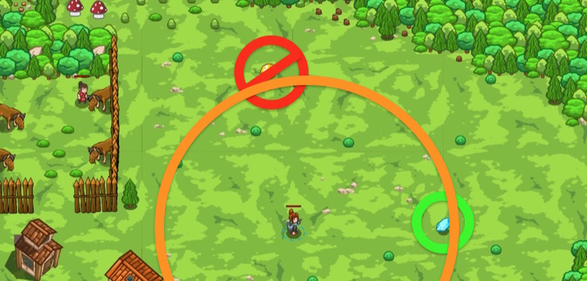

## _Star Shower_

#### _Legend says:_
> A star shower isn't only a terrific phenomenon but a good opportunity to get some money.

#### _Goals:_
+ _Gather all gems_
+ _Gather at least 3 coins_

#### _Topics:_
+ **Strings**
+ **Variables**
+ **While Loops**
+ **If Statements**
+ **Accessing Properties**
+ **Boolean OR**

#### _Items we've got (- or need):_
+ None

#### _Solutions:_
+ **[JavaScript](starShower.js)**
+ **[Python](star_shower.py "Top-20 - 11.4s")**

#### _Rewards:_
+ 69 xp
+ 79 gems

#### _Victory words:_
+ _DID YOU MAKE A WISH?_

___

### _HINTS_



A star shower is raining gems and coins down on you! But star metal isn't long-lived and coins disappear quickly. Gems don't disappear.

Use an **OR** statement to pick up close coins, OR gems:

```javascript
if(item.type == "gem" || distance < 20) {
    // Get the item!
}
```

**_P.S._:Don't eat mushrooms!**

___
