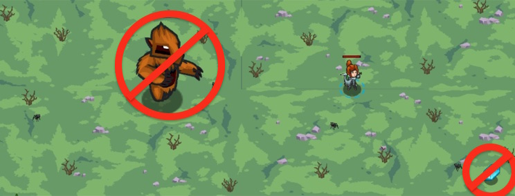

## _Cursed Wonderglade_

#### _Legend says:_
> Withered trees. Snow. The scary statue. What has happened to our Wonderglade?!

#### _Goals:_
+ _Collect coins_
+ _Defeat ogres_

#### _Topics:_
+ **Strings**
+ **Variables**
+ **While Loops**
+ **If Statements**
+ **Nested If Statements**
+ **Accessing Properties**

#### _Items we've got (- or need):_
+ Weapon
+ Longrange glasses

#### _Solutions:_
+ **[JavaScript](cursedWonder.js)**
+ **[Python](cursed_wonder.py)**

#### _Rewards:_
+ 69 xp
+ 79 gems

#### _Victory words:_
+ _HOW MUCH SCRUBBING DOES IT TAKE TO UNCURSE SOMETHING?_

___

### _HINTS_

We returned to Wonderglade, but it's changed. Ogres cursed the glade!

The burl is still here so don't touch gems. Collect all items **except** gems (`item.type` is `"gem"`). Also defeat all enemies **except** the burl (`enemy.type` is `"burl"`).

You know how to use the operator `not equal to` (`!=`) from the previous levels. Use that knowledge to complete this level.

You need to write two blocks inside `while-true` loop. The first one for items: if there is an item and its type **not equal to "gem"**, then collect it. The second one for enemies: if there is an enemy and its type **not equal to "burl"**, then attack it.

___
