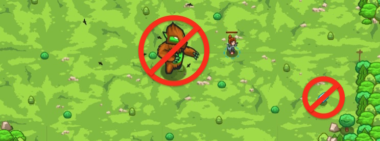

## _Wonderglade_

#### _Legend says:_
> If you need an item, you can find it in Wonderglade.

#### _Goals:_
+ _Pick up 3 coins_
+ _Pick up a mushroom_
+ _Pick up a potion_

#### _Topics:_
+ **Strings**
+ **Variables**
+ **While Loops**
+ **If Statements**
+ **Nested If Statements**
+ **Accessing Properties**

#### _Items we've got (- or need):_
+ Longrange glasses

#### _Solutions:_
+ **[JavaScript](wonderglade.js)**
+ **[Python](wonderglade.py)**

#### _Rewards:_
+ 69 xp
+ 79 gems

#### _Victory words:_
+ _DO NOT UNDERESTIMATE THE POWER OF THE WONDERGLADE._

___

### _HINTS_



Wonderglade can give you any items that you need. You arrived here to collect some ingredients and coins. But you aren't the only one here. That burl likes shiny gems! The burl doesn't like if someone takes its gems.

Collect all items **except** gems (`item.type` is `"gem"`). The comparison operator `not equal to` (`!=`) can be useful for that.

The operator **not equals to** is written as `!=`. It can be very useful when you have many **positive** conditions and only one **negative**. In this case instead of enumerating all conditions when you can do something, you can use `!=` once and describe the reverse case. Also, it can be used for cases when you don't know all 'positive' conditions, but you definitely know what you shouldn't do.

So instead to check all types those you need to pick up:

```javascript
if (item.type == "coin") {
    // Do something
}
if (item.type == "potion") {
    // Do something
}
```

You can just to check for the non-equality for the certain restricted type:

```javascript
if (item.type != "gem") {
    // Do something
}
```

___
