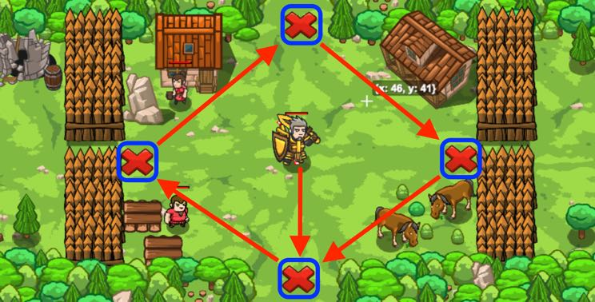

## _Closed Crossroad_

#### _Legend says:_
> A fence? A trap? It depends on the location and the function of course.

#### _Goals:_
+ _Peasants must survive_
+ _Protect the Village_

#### _Topics:_
+ **Basic Syntax**
+ **Strings**
+ **Variables**
+ **While Loops**
+ **If Statements**
+ **Functions**

#### _Items we've got (- or need):_
+ Hammer

#### _Solutions:_
+ **[JavaScript](closedCross.js)**
+ **[Python](closed_cross.py)**

#### _Rewards:_
+ 80 xp
+ 45 gems

#### _Victory words:_
+ _NO CROSSROAD FOR YOU, OGRES!_

___

### _HINTS_



The village is located on a busy crossroad and only a skilled builder can protect it! Move around the village clockwise.

Use `"fire-trap"`s for the top and the bottom passages. Use `"fence"`s for the left and the right passages.

Functions can define many parameters, and they can be different types such as strings or numbers.

Like `buildXY`, which has 3 parameters: a string (the type of object to build), and two numbers (the x and y coordinates).

```javascript
function sureBuildSomething(typeToBuild, x, y) {
    // When this function is called below,
    // typeToBuild will be "fence"
    // x will be 20 and y will be 40
    hero.buildXY(typeToBuild, x, y);
}

sureBuildSomething("fence", 20, 40);
```

`typeToBuild` is a **string**, `x` and `y` are **numbers**.

_**Note**: When you call a function, the order of arguments should be the same as the order they're defined in._

Now you can use one function for `"fence"`s and `"fire-trap"`s instead of two and make your code simpler!

___
