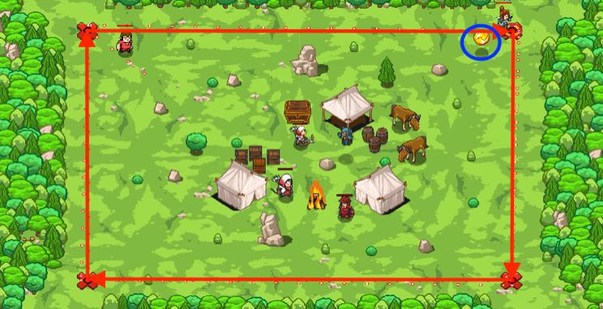

## _Greed Traps_

#### _Legend says:_
> It is a lovely day for hunting greedy ogres.

#### _Goals:_
+ _Lure and defeat the ogres_

#### _Topics:_
+ **Basic Syntax**
+ **Strings**
+ **Variables**
+ **While Loops**
+ **If Statements**
+ **Functions**

#### _Items we've got (- or need):_
+ Hammer

#### _Solutions:_
+ **[JavaScript](greedTraps.js)**
+ **[Python](greed_traps.py)**

#### _Rewards:_
+ 80 xp
+ 45 gems

#### _Victory words:_
+ _HOOK, LINE, AND SINKER!_

___

### _HINTS_

Lure ogres into traps with coins!

Your task is to patrol (move to each X mark in turn) and watch for coins.

If a coin appears, then build a fire trap on the X mark.

Peasants are roaming the forest as well so **only build traps when you see a coin**.

Avoid collecting the coins because they act as bait for you traps. 

The previous levels should have prepared you well for this challenge. The only difference is that you need to write the function yourself.

If you have problems with this level, then try to return previous levels about function and refresh your skills.

___
