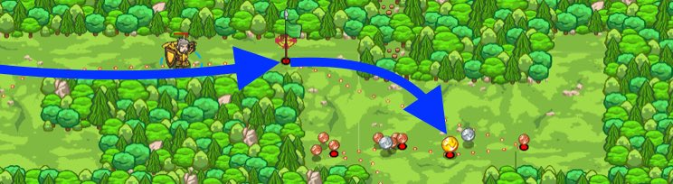

## _Copper Meadows_

#### _Legend says:_
> This level exercises: if/else, object members, variables, flag placement, and collection.

#### _Goals:_
+ _Use flags to collect all the coins_

#### _Topics:_
+ **Variables**
+ **While Loops**
+ **If Statements**
+ **If/Else Statements**
+ **Nested If Statements**
+ **Accessing Properties**

#### _Items we've got (- or need):_
+ Flag

#### _Solutions:_
+ **[JavaScript](copper.js)**
+ **[Python](copper.py "Top-5: 21.38s")**

#### _Rewards:_
+ 73 xp
+ 82 gems

#### _Victory words:_
+ _YOU DON'T MISS A SINGLE COPPER, DO YOU?_

___

### _HINTS_



Just like checking an enemy's `type`, you can check the position or `pos` of a flag. You can even find the `x` and `y` coordinates of a flag's `pos`.

```javascript
var flag = hero.findFlag();
hero.say(flag.pos);
hero.say(flag.pos.x);
```

Use your `pickUpFlag` method to go to and pick up flags that you place. Your new glasses have the `findNearestItem` method, which lets your hero automatically pick up coins, but only when in line of sight. Use flags to guide your hero to each meadow full of coins.

You can move to an item's position like this:

```javascript
var item = hero.findNearestItem();
if (item) {
    var position = item.pos;
    var x = position.x;
    var y = position.y;
    hero.moveXY(x, y);
}
```

Each item is an **object**, which is a type of data, like a **string** or a **number**. Objects contain other pieces of data, known as **properties**.

Each item object (and each unit) has a `pos` property, which stands for its position. And each `pos` is itself an object, which has `x` and `y` properties that you can use with `moveXY` and `buildXY`.

_**Tip**: remember that you need to press Submit before you can place flags. The meadows are randomized, so the layout will change each time._

___
