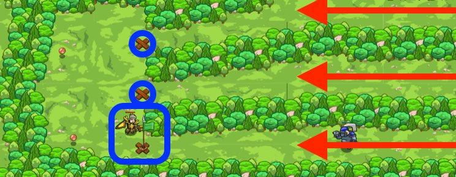

## _Drop the Flag_

#### _Legend says:_
> Use flags to position traps interactively.

#### _Goals:_
+ _Defeat all the ogres with traps_
+ _Collect all the coins_

#### _Topics:_
+ **Strings**
+ **Variables**
+ **While Loops**
+ **If Statements**
+ **Nested If Statements**
+ **Accessing Properties**

#### _Items we've got (- or need):_
+ Flag

#### _Solutions:_
+ **[JavaScript](dropFlag.js)**
+ **[Python](drop_flag.py)**

#### _Rewards:_
+ 76 xp
+ 85 gems

#### _Victory words:_
+ _YOU KEPT THE GOLD TO YOURSELF._

___

### _HINTS_

Before using `pickUpFlag()`, use `buildXY()` to build a `"fire-trap"` at the `flag`'s position

A coin is like a flag, it has a `pos`. Use the coin's `pos` to `moveXY()` to collect them.

Use your `pickUpFlag` method to go to and pick up flags that you place, but first, use `buildXY` to build a `"fire-trap"` where the flag is.

Just like in the last level, where each coin item is an object, each flag is also an object. Each flag and item object has a `pos` property, which stands for its position. And each `pos` is itself an object, which has `x` and `y` properties that you can use with `moveXY` and `buildXY`.

Code your hero to build traps where she sees flags, and then when you see an ogre coming, place a flag on the X so your hero responds. When there is no flag, your hero will collect coins. **Wait for your hero to pick up the flag** before placing another one, or she won't place the fire-trap at the second flag.

_**Tip**: remember that you need to press Submit before you can place flags. The ogres are randomized, so they'll come from different paths each time._

___
