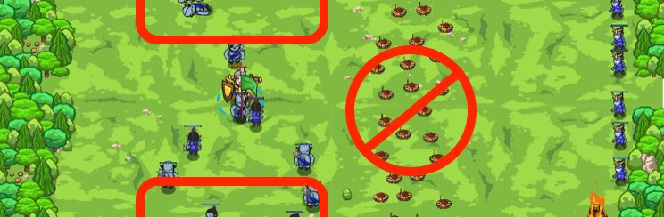

## _Mind the Trap_

#### _Legend says:_
> Don't take the bait!

#### _Goals:_
+ _Defeat the ogres on your side of the mines_

#### _Topics:_
+ **Strings**
+ **Variables**
+ **While Loops**
+ **If Statements**
+ **If/Else Statements**
+ **Nested If Statements**

#### _Items we've got (- or need):_
+ Flag

#### _Solutions:_
+ **[JavaScript](mindTrap.js)**
+ **[Python](mind_trap.py)**

#### _Rewards:_
+ 100 xp
+ 54 gems

#### _Victory words:_
+ _STAND CLEAR OF THE MINES PLEASE_

___

### _HINTS_

Use flags and `distanceTo()` so you don't run over the mines!

Some actions your hero takes will pause the rest of your program while they happen. One of these is `attack`.

When you do an `attack` against an enemy that's far away, your program will stop responding to other commands (like `pickUpFlag`) while your hero runs toward the enemy.

In this level, that means your hero will run straight into the mines! (**boom!**)

To avoid this, you'll use `distanceTo`, and only attack enemies if they are within `10` meters of you.

Then, use your flags to move close to any enemy you want to attack!

___
