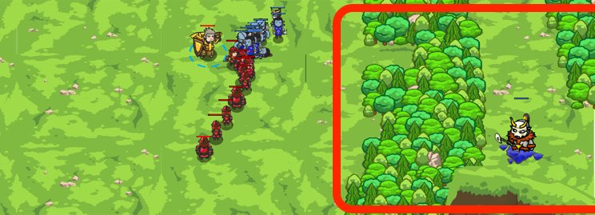
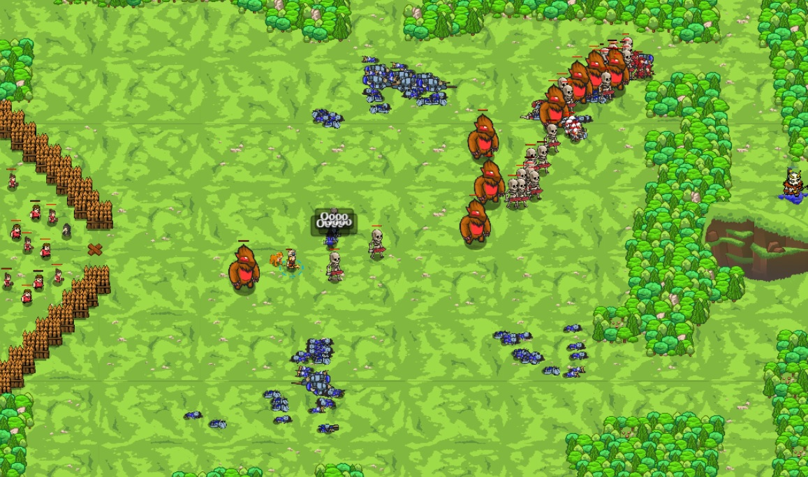

## _Siege of Stonehold_

#### _Legend says:_
> Unlock the desert world, if you are strong enough to win this epic battle!

#### _Goals:_
+ _Defeat Thoktar's ogre assault_
+ _Your hero must survive_

#### _Topics:_
+ **Basic Syntax**
+ **Variables**
+ **While Loops**
+ **If Statements**
+ **If/Else Statements**
+ **Nested If Statements**

#### _Items we've got (- or need):_
+ Flag

#### _Solutions:_
+ **[JavaScript](siege.js)** _warrior_
+ **[Python](siege.py)** _wizard_

#### _Rewards:_
+ 129 xp
+ 120 gems

#### _Victory words:_
+ _YOU'VE LIFTED THE SIEGE AND UNLOCKED THE DESERT!_

___

### _HINTS_

Help your allies defeat Thoktar's forces. Go to the **healer** near the X on the left side of the map if you need to heal.

Your allied troops aren't strong enough to win this fight. If you have 500+ health (as a Warrior) or a really clever strategy, you may be able to turn the tides of this battle. The peasants aren't good in a fight, but one among them is a doctor. Go to him if you're wounded.

This is an open-ended level, so it's up to you how to solve it. Using flags to guide your strategy is recommended. It may also help to check the distance to your enemy and not to chase it unless it's close enough.

Your hero must survive, but allied casualties are... expected. Your archers deal a lot of damage but are defeated easily - it's a good idea for you to protect them!

Once you succeed in this battle, the desert campaign awaits you!

Warning! To much burls for this fight!

___
