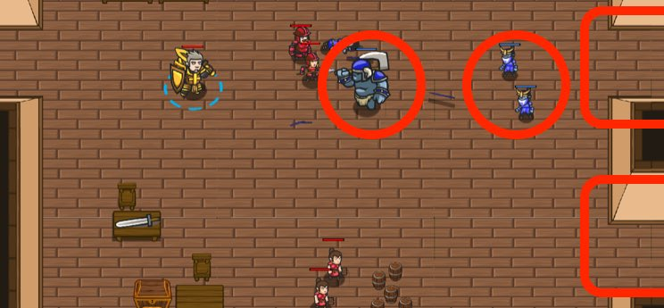

## _Storming the Farmhouse_

#### _Legend says:_
> A band of rangers is on the way, but the ogres are already coming! Hold your ground and try to protect the peasants from the rampaging marauders. _Created by player **Delve**._

#### _Goals:_
+ _Hold out for the rangers_
+ _Repel all invaders_
+ _Bonus: Save the peasants (2)_

#### _Topics:_
+ **Basic Syntax**
+ **Variables**
+ **While Loops**
+ **If Statements**
+ **If/Else Statements**
+ **Nested If Statements**

#### _Solutions:_
+ **[JavaScript](stormingFarm.js)** _warrior_
+ **[Python](storming_farm.py)** _wizard_

#### _Rewards:_
+ 74-110 xp
+ 48-72 gems

#### _Victory words:_
+ _THAT FARMHOUSE MADE A SURPRISINGLY GOOD IMPROMPTU BATTLEGROUND. YOU SAVED TWO INNOCENT BYSTANDERS FROM THE BRAWL._

___

### _HINTS_

Use flags to defend each entrance to the house. Use `cleave()` when you can to clear out masses of enemies.

On this level, you need to survive and protect the peasants. Use flags to maneuver your hero (remember you need to press Submit to use flags).

If you're having trouble, try using area attacks like Cleave when a large mob of ogres attacks.

___
