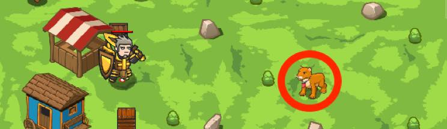

## _Phd Kitty_

#### _Legend says:_
> Impress peasants with the smartest cougar pet.

#### _Goals:_
+ _Have pet answer the 1st question_
+ _Have pet answer the 2nd question_
+ _Have pet answer the 3rd question_
+ _Ask your pet three questions_

#### _Topics:_
+ **Basic Syntax**
+ **Arguments**
+ **Strings**
+ **Functions**

#### _Solutions:_
+ **[JavaScript](phdKitty.js)**
+ **[Python](phd_kitty.py)**

#### _Rewards:_
+ 79 xp
+ 45 gems

#### _Victory words:_
+ _THE SMARTEST, TALKING COUGAR THERE EVER WAS!_

___

### _HINTS_



Let's make a little show for the people in this small village.

Use `pet.say()` to have your pet answer when she hears a question.

Don't forget to use `pet.on()` to assign the `sayTwo` function as the handler for the `"hear"` event.

Teach Kitty how to perform special tricks to astound! Preprogram Kitty with the correct answer and impress the onlookers by asking rigged questions.

```javascript
function sayApplesauce(event) {
    pet.say("Applesauce");
}

pet.on("hear", sayApplesauce);

hero.say("What is made up of apples?");
hero.say("What is meshed up into a sauce?");
hero.say("What is improved with a little cinnamon?");
```

___
