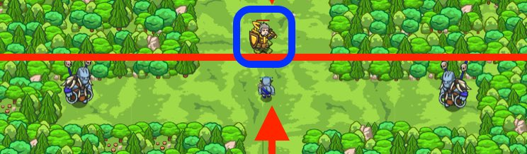

## _JavaScript: Stillness in Motion_

#### _Legend says:_
> Remain centered with nested if-statements.

#### _Goals:_
+ _Stay in the center to avoid the headhunters_
+ _Defeat 15 incoming munchkins_

#### _Topics:_
+ **Variables**
+ **While Loops**
+ **If Statements**
+ **If/Else Statements**
+ **Nested If Statements**
+ **Boolean Greater/Less**

#### _Solutions:_
+ **[JavaScript](inMotion.js)**

#### _Rewards:_
+ 60 xp
+ 20 gems

#### _Victory words:_
+ _YOU REMAINED PERFECTLY STILL! WHILE SWINGING THAT SWORD LIKE CRAZY._

___

### _HINTS_



Imagine each `if/else` as a container. It is acceptable to put another `if/else` statement inside of another! See:

```javascript
var enemy = hero.findNearestEnemy();
if(enemy) {
    if(enemy.type == "munchkin") {
        hero.say("I see a munchkin!");
    } else {
        hero.say("I see some other kind of enemy!");
    }
} else {
    hero.say("I don't see any enemies...");
}
```

Remember to pay close attention to your indentation.

In this level, you need to:
1. Get the distance between the `hero` and `enemy`
2. If the distance is less than 5, `attack` the enemy.
3. else, use your `shield`

When you have an if statement inside an if statement, make sure your code blocks are correct!

For this level, you want to stay in the middle where the Headhunters can't see you!

___

##### You will use _nested-if-statements_

When dealing with nested if statements, you need to pay close attention to how you set up the flow of your program.

If your if statements are complicated, it's often easier to build them up one at a time, using comments to fill in the future statements. For example, in this level we could begin by writing the following:

```javascript
// If there is an enemy, then...
    // Do something.
// Otherwise (there is no enemy)...
    // Move back to the X.
```

Next, fill in the outer if/else statements, and the move, for real:

```javascript
if (enemy) {
    // Do something
} else {
    hero.moveXY(40, 34);
}
```

Now, let's detail the **Do something** part:

```javascript
if (enemy) {
    // If the enemy is less than 5 meters away, then attack
    // Otherwise (the enemy is far away), shield()
} else {
    hero.moveXY(40, 34);
}
```

Finally, fill in the actual code for the inner if/else, making sure everything is indented correctly:

```javascript
if (enemy) {
    if (hero.distanceTo(enemy) < 5) {
        hero.attack(enemy);
    } else {
        hero.shield();
    }
} else {
    hero.moveXY(40, 34);
}
```

And, this entire block of if-s and else-s has to be indented under the **while-true loop** like:

```javascript
while (true) {
    var enemy = hero.findNearestEnemy();

    if (enemy) {
        if (hero.distanceTo(enemy) < 5) {
            hero.attack(enemy);
        } else {
            hero.shield();
        }
    } else {
        hero.moveXY(40, 34);
    }
}
```

**Hint**:  You can highlight several lines of code and press _Tab_ to indent all of those lines, or _Shift+Tab_ to un-indent all of those lines!

___
