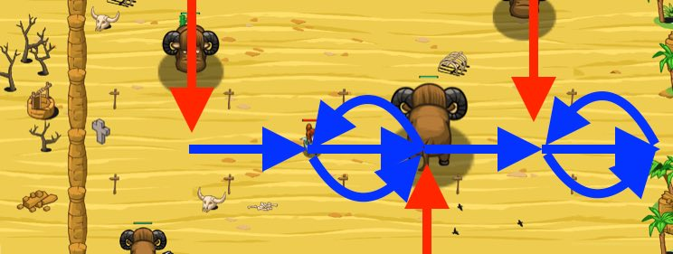

## _Oasis_

#### _Legend says:_
> Run a gauntlet of sand yaks to reach the oasis and quench your thirst.

#### _Goals:_
+ _Move right to the oasis_

#### _Topics:_
+ **Variables**
+ **While Loops**
+ **If Statements**
+ **If/Else Statements**
+ **Boolean Greater/Less**
+ **Accessing Properties**

#### _Solutions:_
+ **[JavaScript](oasis.js)** _warrior_
+ **[Python](oasis.py)** _wizard_

#### _Rewards:_
+ 146 xp
+ 131 gems

#### _Victory words:_
+ _YAK DODGING IS THIRSTY WORK!_

___

### _HINTS_



Move right until you get close to a yak, then move left.

To move left, subtract from `hero.pos.x`.

To move right, add to `hero.pos.x`.

If the enemy is too close, the hero should move away from the oasis.

Use the `-=` operator to subtract 10 from the x variable.

```javascript
x -= 10;
```

Be sure to use `moveXY` to actually move to the position.

```javascript
hero.moveXY(x, y);
```

Else, it's clear to move towards the oasis. Use `+=` to add 10 to the x variable.

```javascript
x += 10;
```

Remember to use `moveXY`, with these new variables to actually move.

In this level, you access your `hero.pos` to move relative to the hero's current position.

If the nearest `"sand-yak"` is less than `10` meters away, move `10` meters to the **left** (subtract from your `x` position) to dodge it.

Otherwise, move `10` meters to the **right** (add to your `x` position) to get closer to the oasis.

_**Hint**: Using a partial move technique like this lets you change what you're doing en route to a position, 
which is very helpful for responding to changing threats and new information._

___
