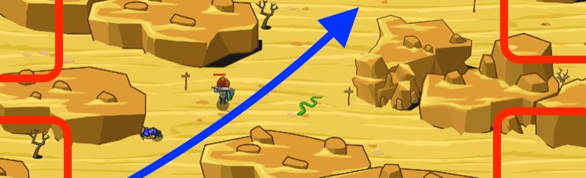

## _Sarven Road_

#### _Legend says:_
> Watch out for ogre scouts on the road as you search for water.

#### _Goals:_
+ _Your hero must survive_
+ _Get to the oasis_
+ _Defeat the ogre scouts_

#### _Topics:_
+ **Basic Syntax**
+ **Variables**
+ **While Loops**
+ **If Statements**
+ **If/Else Statements**
+ **Accessing Properties**

#### _Solutions:_
+ **[JavaScript](sarvenRoad.js)**
+ **[Python](sarven_road.py)**

#### _Rewards:_
+ 151 xp
+ 135 gems

#### _Victory words:_
+ _BEWARE THE NARROW CANYONS._

___

### _HINTS_



If you see an enemy, attack it! Otherwise, move up and to the right.

You move up by adding to your `pos.y`.

You move right by adding to your `pos.x`.

First start by finding the nearest enemy.

```javascript
var enemy = hero.findNearestEnemy();
```

Use an `if/else` to check if an enemy actually exists:

```javascript
if (enemy) {
    // ...
} else {
    // ...
}
```

If the enemy exists, defend yourself by `attack`ing them:

```javascript
hero.attack(enemy);
```

Else, when there are no nearby enemies, move towards the oasis.

Create two variables to store the player's position:

```javascript
var xPos = hero.pos.x;
var yPos = hero.pos.y;
```

Finally, move in the direction of the oasis by adding 5 to both the x and y while moving.

You move diagonally up and to the right by adding to both your `x` position and your `y` position.

First `findNearestEnemy`.

**if** there is one, attack it!

**else** (there is no enemy), move to the new `x + 5` and `y + 5` coordinates.

The ogre scouts are tougher than munchkins.

___
