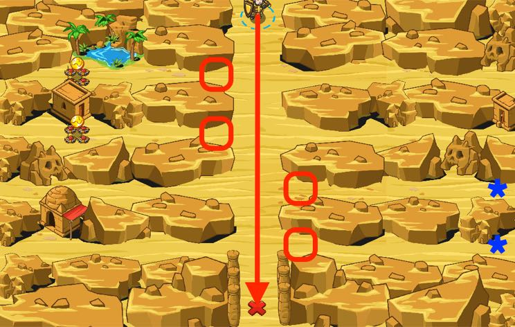

## _Double Gaps_

#### _Legend says:_
> Coins are at the left, ogres are at the right. There is only one answer and it's Fences!

#### _Goals:_
+ _Get humans to the south_

#### _Topics:_
+ **Basic Syntax**

#### _Solutions:_
+ **[JavaScript](doubleGaps.js)**
+ **[Python](double_gaps.py)**

#### _Rewards:_
+ 151 xp
+ 139 gems

#### _Victory words:_
+ _WALLS ARE USED IN BOTH DIRECTIONS._

___

### _HINTS_

Build fences against ogres and **coins** otherwise the peasant would try to get some gold.

You can get an enemy's or item's `pos` with `thing.pos`, then add or subtract from their `x` and `y` coordinates, just like your `hero`.

Remember, subtract from `x` to go left, add to go right.

Use what you learned in the previous levels to use relative positions. 

If you see ogres, build a fence `20` meters to the **left** of their `pos` so that they can't get through. If you see coins, build a fence `20` metres to the **right** of their `pos` so that your peasants can't get through.

_**Tip**: you can access the `pos` property on your hero, on enemies, on friends, and even on items._

___
