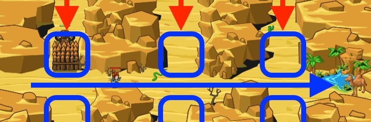

## _Thunderhooves_

#### _Legend says:_
> Fence off the stampeding sand yaks to reach the next watering hole.

#### _Goals:_
+ _Get to the oasis_

#### _Topics:_
+ **Strings**
+ **Variables**
+ **While Loops**
+ **If Statement**
+ **Nested If Statement**
+ **Accessing Properties**

#### _Solutions:_
+ **[JavaScript](thunderhooves.js)**
+ **[Python](thunderhooves.py)**

#### _Rewards:_
+ 163 xp
+ 143 gems

#### _Victory words:_
+ _GOOD THING IT ONLY TAKES ONE SECOND TO BUILD A FENCE!_

___

### _HINTS_



Build `"fence"`s to block the yaks coming at you randomly from above and below. Move right towards the oasis if you can't see a yak.

When you see a yak, compare its `pos.y` to your `hero.pos.y`.

If the yak's y position is greater than hero's, the yak is above the hero. Otherwise, the yak is below the hero.

___

Use an **if/else** statement to compare which direction the yak is.

If a yak's position is greater-than `>` the hero's position, that yak is above the hero!

Else, the yak must be below the hero.

```javascript
if (yak.pos.y > hero.pos.y) {
    // ...
} else {
    // ...
}
```

Build a fence below the yak if the yak is above the hero.

```javascript
hero.buildXY("fence", yak.pos.x, yak.pos.y - 10);
```

Else, the yak is below the hero and the fence should be above the yak.

```javascript
hero.buildXY("fence", yak.pos.x, yak.pos.y + 10);
```

Remmeber to move right if there is no yak in sight.

The sand yaks are randomly coming from either the top or the bottom, so you'll have to compare their `y` position with your `y` position to decide whether to build fences above or below them.

If the yak's `pos.y` is greater than your `pos.y`, that means the yak is above, so you should build below the yak. Otherwise, build above the yak.

_**Hint**: Use the greater-than operator `>` on the yak's position's y property._

_**Hint**: Remember, use `buildXY` to build a `"fence"`._

___
