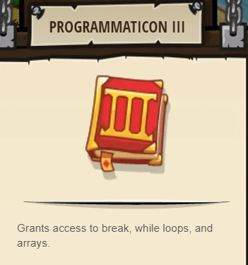
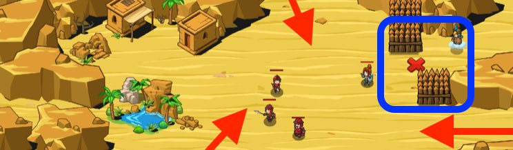

## _Medical Attention_

#### _Legend says:_
> Get help from a helpful wizard while you fend off an ogre attack.

#### _Goals:_
+ _Defeat the ogres_

#### _Topics:_
+ *Strings**
+ **Variables**
+ **While Loops**
+ **If Statement**
+ **Nested If Statement**
+ **Accessing Properties**

#### _Solutions:_
+ **[JavaScript](medicalAttention.js)** _warrior_
+ **[Python](medical_attention.py)** _wizzard_

#### _Rewards:_
+ 169 xp
+ 147 gems
+ **Programmaticon III**



#### _Victory words:_
+ _YOU KNOW WHAT THEY SAY: DISCRETION > VALOR / 2._

___

### _HINTS_



Compare your `health` to a fraction of `maxHealth` using the division operator: `/`.

Head to the healer and ask for a `"heal"` if you are hurt.

Use an `if/else` statement to check if the hero's health is below the healingThreshold.

The **less than** operator, or `<` can be used to check if a number is below another number.

```javascript
if (hero.health < healingThreshold) {
    // ...
} else {
    // ...
}
```

If the hero's health is under the threshold, move back to the healer!

```javascript
hero.moveXY(65, 46);
```

Politely request a heal.

```javascript
hero.say("Heal, please!");
```

Else, if the hero's health is okay, continue the fight!

Remember how to fight: find the nearest enemy, check if it exists, then attack it!

Sometimes you just have to run back to a medic before you can keep fighting. It happens to all of us. In this level, you compare your `health` to your `maxHealth` divided by 2 with the division operator: `/`.

_if_ your `health` is _less than_ your `maxHealth` _divided by_ `2` _then_ go get healed, _else_, _if_ there is an enemy, _then_ keep fighting.

When you go for a heal, make sure you're in position and you say, `"heal me"`

___
