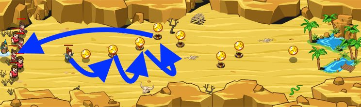

## _Minesweeper_

#### _Legend says:_
> Lead a band of hapless peasants through a treacherous canyon while you heroically trigger the mines.

#### _Goals:_
+ _Keep everyone alive_
+ _Get everyone to the oasis_

#### _Topics:_
+ **Strings**
+ **Variables**
+ **While Loops**
+ **If Statements**
+ **Nested If Statements**
+ **Accessing Properties**

#### _Solutions:_
+ **[JavaScript](minesweeper.js)**
+ **[Python](minesweeper.py)**

#### _Rewards:_
+ 176 xp
+ 151 gems

#### _Victory words:_
+ _SEE, THAT ONLY HURT A WHOLE LOT._

___

### _HINTS_

Clear the path for your allies!

Move to each coin, and step on any mines that might be under them.

If your health gets too low, move left 10 meters and say `"Heal please!"` to the Doctor.

Recall how to move relative to the hero's position!

Detonate the mines with your own body! The peasants will follow you, but you'll need to run back 10m to the left to ask Doctor Beak for a heal if your health gets too far below your maxHealth.

To trigger a mine, move to the coin on top of it. You can use the `findNearestItem` method to know where to go.

___
