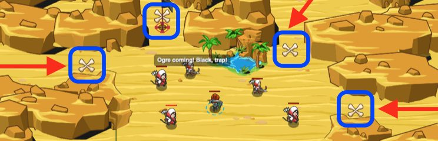

## _Sarven Sentry_

#### _Legend says:_
> Listen to your scouts to corral yaks and trap ogres.

#### _Goals:_
+ _Defeat the ogres_
+ _Fence in yaks_

#### _Topics:_
+ **Basic Syntax**
+ **Strings**
+ **Variables**
+ **While Loops**
+ **If Statements**
+ **Accessing Properties**

#### _Solutions:_
+ **[JavaScript](sarventSentry.js)**
+ **[Python](sarven_sentry.py)**

#### _Rewards:_
+ 183 xp
+ 155 gems

#### _Victory words:_
+ _YOU WON WITH THE CUNNING USE OF FLAGS!_

___

### _HINTS_



You can use flags with different colors to perform different tasks.

Use a `green` flag to build a `"fence"`.

Use a `black` flag to build a `"fire-trap"`.

Watch your archers, they tell you what to build! The bouncing X shows where to place your flag.

Remember to pick up your flags after building!

___

Use different colored flags to do different actions. Use an `if`-statement to check if a green flag exists.

```javascript
if (flagGreen) {
    // ...
}
```

If the green flag exists, build a `"fence"` at it's location:

```javascript
hero.buildXY("fence", flagGreen.pos.x, flagGreen.pos.y);
```

Be sure to pick up the flag afterwards:

```javascript
hero.pickUpFlag(flagGreen);
```

Next check if the black flag exists using an `if`-statement:

```javascript
if (flagBlack) {
    // ...
}
```

Build a `"fire-trap"` at the black flag's location, should it exist:

```javascript
hero.buildXY("fire-trap", flagBlack.pos.x, flagBlack.pos.y);
```

Again, remember to pick up the flag once you're done with it:

In this level, you'll use different color flags to tell your hero to perform different tasks.

Watch the archers, they'll let you know if an ogre or a sand yak is coming. Then you'll place flags to build on the X mark near that archer.

If there's a sand yak coming, you'll build a `"fence"` using `flagGreen.pos.x` and `flagGreen.pos.y` as the X and Y for `buildXY`.

If there's an ogre coming, you'll build a `"fire-trap"` using `flagBlack.pos.x` and `flagBlack.pos.y` as the X and Y for `buildXY`.

After building with any of these flags, remember to use `pickUpFlag` to remove the flag.

___
