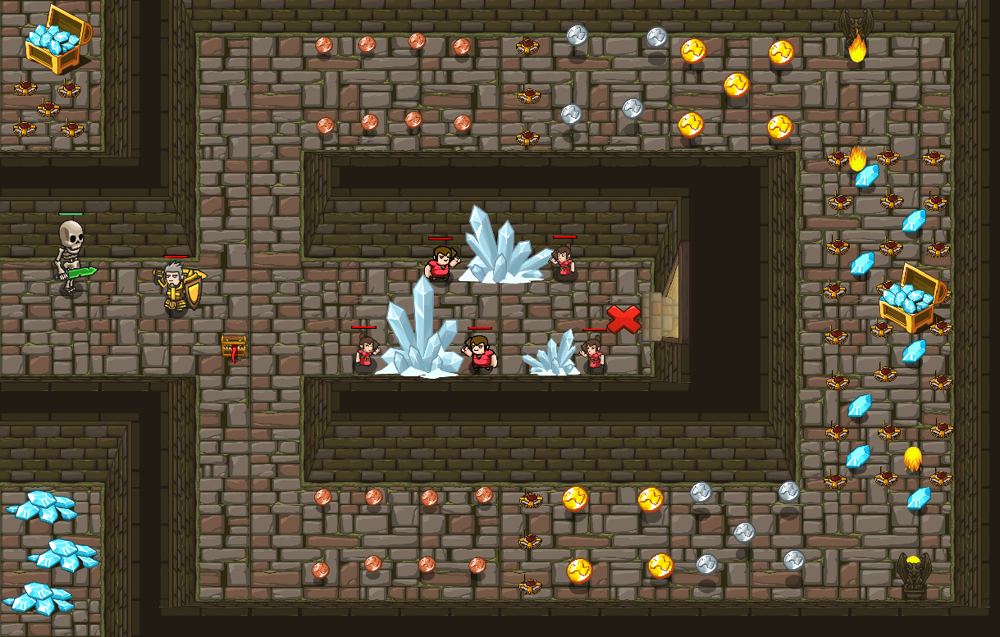

## _Underground Business_

#### _Legend says:_
> Treasures are everywhere. As well as traps and skeletons.

#### _Goals:_
+ _Collect 300 gold_
+ _Escape from the dungeon_

#### _Topics:_
+ **Basic Syntax**

#### _Solutions:_
+ **[JavaScript](kithgardEnchanter.js)** _wizard_
+ **[Python](kithgard_enchanter.py)** _warrior_

#### _Rewards:_
+ 160 xp
+ 160 gems

#### _Victory words:_
+ _NEXT, WE NEED COFFEE AND DONUT MAGNET ABILITY._

___

### _HINTS_



While peasants mine some gold from crystals you need to collect treasures some way. The Mimic pet can help you with it.

The Mimic has a unique ability -- Treasure Magnet. Just send it round the dungeon and all treasures will be yours.

P.S.: Don't forget to protect peasants.

The Mimic loves gold and gold like the Mimic, that's why treasures are attracted by that pretty moving chest. However, the Mimic can't collect gold, so don't forget bring gold trail back to your hero.

You don't need do anything special to pull coins, just move with your pet near treasures and it will follow by the Mimic.

```javascript
var coin = pet.findNearestByType("gold-coin");
pet.moveXY(coin.pos.x, coin.pos.y);
pet.moveXY(hero.pos.x, hero.pos.y);
```

___
