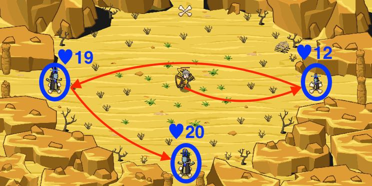

## _Weakest Quickest_

#### _Legend says:_
> The weakests could be the most dangerous

#### _Goals:_
+ _Survive 50 seconds_

#### _Topics:_
+ **Basic Syntax**
+ **Iterating Over Arrays**

#### _Solutions:_
+ **[JavaScript](weekestQuickest.js)**
+ **[Python](weekest_quickest.py)**

#### _Rewards:_
+ 262 xp
+ 195 gems

#### _Victory words:_
+ _CAUGHT YOU!_

___

### _HINTS_

Ogre shamans are casting a deadly spell, so hurry and defeat them. The weakest shamans are the quickest. Attack them first, then the next weakest, and so on.

Be sure to attack the ogres with the least health first.

In this level, you should attack the enemy with the least health first.

You need to complete the function `findWeakestEnemy`. First, you should use a `while` loop to examine each enemy, comparing its health to `leastHealth`. If an enemy's health is lower than `leastHealth`, you set `weakest` to be that enemy, and update `leastHealth` to be that enemy's health.

This way, at the end of your loop, `weakest` will be the enemy with the lowest health.

Then _use_ that function to find and defeat enemies in the order of their health.

___
