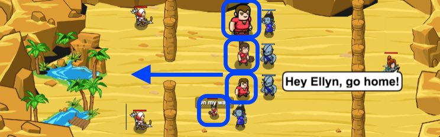

## _Mad Maxer: Redemption_

#### _Legend says:_
> Make the impossible choice to save your friends from destruction.

#### _Goals:_
+ _All humans survive_
+ _Clean up those ogres_

#### _Topics:_
+ **Strings**
+ **Variables**
+ **While Loops**
+ **While Loops with Conditionals**
+ **Array Length**
+ **Accessing Properties**

#### _Solutions:_
+ **[JavaScript](madMaxerRedemption.js)**
+ **[Python](mad_maxer_redemption.py)**

#### _Rewards:_
+ 283 xp
+ 206 gems

#### _Victory words:_
+ _"OHANA" MEANS "FAMILY." "FAMILY" MEANS "NO ONE GETS LEFT BEHIND."_

___

### _HINTS_

Use a `while` loop to look at all of your `friends` and set the friend who has the lowest health as the `weakestFriend`.

Then, the sample code shows you how to tell your friend to retreat. 

___
