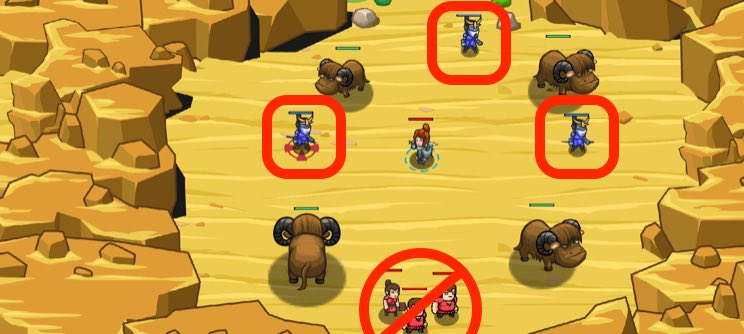

## _Odd Sandstorm_

#### _Legend says:_
> Pick friends from foes and lead your party to the oasis.

#### _Goals:_
+ _Defeat the ogres_
+ _Protect the humans_
+ _Lead humans to the oasis_

#### _Topics:_
+ **Strings**
+ **Variables**
+ **While Loops with Conditionals**
+ **Accessing Properties**
+ **Array Length**
+ **Array Indexing**

#### _Solutions:_
+ **[JavaScript](oddSandstorm.js)**
+ **[Python](odd_sandstorm.py)**

#### _Rewards:_
+ 267 xp
+ 206 gems

#### _Victory words:_
+ _THE PEASANTS ARE EVEN MORE GRATEFUL TO BE ALIVE THAN USUAL._

___

### _HINTS_



Access specific elements in an array with the `[]` notation at the end of a variable name.

`everybody[enemyIndex]` returns the element in `everybody` at `enemyIndex`.

Remember, arrays are `0`-indexed, meaning the first element starts at `[0]`.

The `everybody` array contains the names of both friends and enemies, in an alternating pattern.

```javascript
// Remember to access elements of an array with square brackets:
var ogreName = everybody[enemyIndex];
```

When looping over the array, increment the index by `2` instead of `1`, to skip over your friend's names:

```javascript
// Incrementing by 2 skips every other element in an array.
enemyIndex += 2;
```

___
