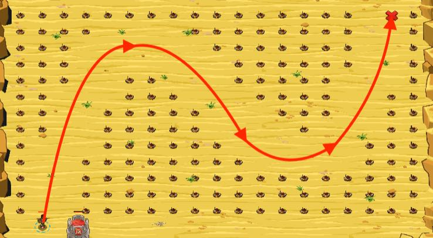

## _Cubic Minefield_

#### _Legend says:_
> Find the path through the minefield with the Power of Mathematics.

#### _Goals:_
+ _Walk through the minefield_

#### _Topics:_
+ **Variables**
+ **While Loops**
+ **While Loops with Conditionals**
+ **Return Statements**
+ **Array Indexes**
+ **Accessing Properties**

#### _Solutions:_
+ **[JavaScript](cubicMinefield.js)**
+ **[Python](cubic_minefield.py)**

#### _Rewards:_
+ 238 xp
+ 189 gems

#### _Victory words:_
+ _NOW THAT'S QUITE POWERFUL._

___

### _HINTS_



Ogres are weak with Mathematics, that's why we are using [cubic equation](https://en.wikipedia.org/wiki/Cubic_function) to define minefield passages. Cubic equation define `y` coordinate based on `x` coordinate.

You are given the code to define `{x, y}` coordinates with the equation. Your task is write the `power` function to calculate an exponent power of a number.

___

Exponentiation is a mathematical operation, involving two numbers, the `base` and the `exponent`. When `exponent` is a positive integer, exponentiation corresponds to repeated multiplication of the base:

```
base ** exponent = base * base * ... * base
                  (     exponent times     )
```

You are given the example for `multiplication` function in the sample code. `power` function has the same logic, but you need to use `*` instead `+` and the initial value of the accumulator (`total`) `1` instead `0`.

Go from:

```
4 * 5 = 4 + 4 + 4 + 4 + 4
```

To this:

```
4 pow 5 = 4 * 4 * 4 * 4 * 4
```

And you'll find victory.

In this level, you are given a multiplication function to start. Consider how the function works:

```
4 * 5 = 4 + 4 + 4 + 4 + 4
```

Now imagine another function which replaces the `+` with `*`:

```
4 pow 5 = 4 * 4 * 4 * 4 * 4
```

That is how the `power` function works. Use this to calculate the path of the cubic polynomial.

___
