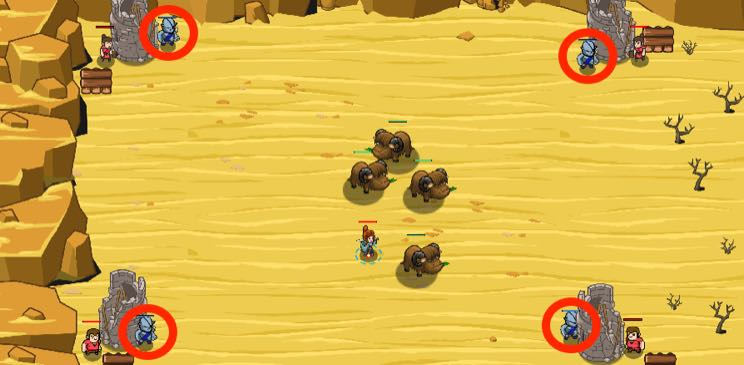

## _Safety Blanket_

#### _Legend says:_
> The peasants are building towers to defend their outpost, but mischievous munchkins are setting back their progress!

#### _Goals:_
+ _Defeat the ogres_

#### _Topics:_
+ **Basic Syntax**
+ **Strings**
+ **Variables**
+ **Array Indexes**
+ **Array Indexing**
+ **Array Literals**

#### _Solutions:_
+ **[JavaScript](safetyBlanket.js)**
+ **[Python](safety_blanket.py)**

#### _Rewards:_
+ 238 xp
+ 189 gems

#### _Victory words:_
+ _NOTHING MORE COMFORTING THAN FOUR ARROW TOWERS AROUND YOUR TOWN._

___

### _HINTS_



Defeat the ogre munchkins terrorizing the builders.

Attack **every other** name in an array to succeed.

Elements of an array can be accessed in any order. Forwards or backs, or all mixed up, sometimes it is valuable to access an index in the middle of an array.

```javascript
var daysOfTheWeek = ["Sun", "Mon", "Tue", "Wed", "The", "Fri", "Sat"];
var middleOfTheWeek = daysOfTheWeek[3];
// Remember arrays are 0-indexed!
// While 4 is in the middle of 1-7, 3 is the middle of 0-6.
```

___
