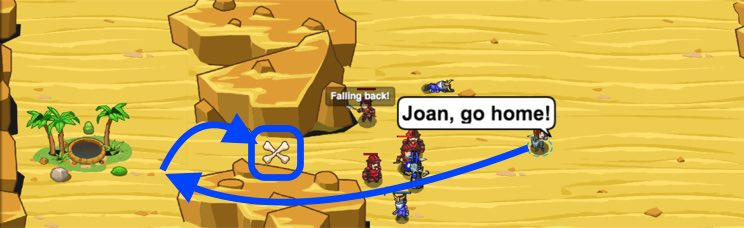

## _Sarven Savior_

#### _Legend says:_
> Use arrays to bring home your friends and keep out your foes.

#### _Goals:_
+ _Call friends home_
+ _Keep ogres out_

#### _Topics:_
+ **Strings**
+ **Variables**
+ **While Loops with Conditionals**
+ **Accessing Properties**
+ **Array Literals**
+ **Iterating Over Arrays**

#### _Solutions:_
+ **[JavaScript](sarvenSavior.js)**
+ **[Python](sarven_savior.py)**

#### _Rewards:_
+ 257 xp
+ 200 gems

#### _Victory words:_
+ _THEY THOUGHT YOU WERE GOING TO LEAVE THEM OUT THERE FOREVER._

___

### _HINTS_



An `array` is a list of items.

```javascript
// An array of strings:
var friendNames = ['Joan', 'Ronan', 'Nikita', 'Augustus'];
```

___

Arrays are ordered lists of data. In this level, you have an array storing the string names of your four friends.

In order to save your friends, you'll need to tell each one of them to return home in turn. You can use the provided sample code to loop over an **array**.

```javascript
// friendNames is an array.
var friendNames = ['Joan', 'Ronan', 'Nikita', 'Augustus'];

// You can access specific elements of an array using a number surrounded by square brackets:
var name = friendNames[0];

// Causes the hero to say: "Joan"
hero.say(name);
```

You can use an index **variable** instead of a number, to access an element of the array.

To loop over all the values in an array, use a **while-loop** to increment the index variable each loop!

On each pass through the loop, you'll retrieve the friend name at that array index, then tell the friend to go home.

```javascript
var friendNames = ['Joan', 'Ronan', 'Nikita', 'Augustus'];

// Arrays start at index 0
var friendIndex = 0;

// friendNames.length gives you the length of the friendNames array.
// The length is equal to the number of items in the array (4, in this case)

while (friendIndex < friendNames.length) {
    var fruiendName = friendNames[friendIndex];
    hero.say(fruiendName + ", go home!");
    friendIndex += 1;
}

// This while-loop will execute using friendIndex 0, then 1, 2 and 3
// Note that the length f the array is 4, but the last element is 3!
```

___
