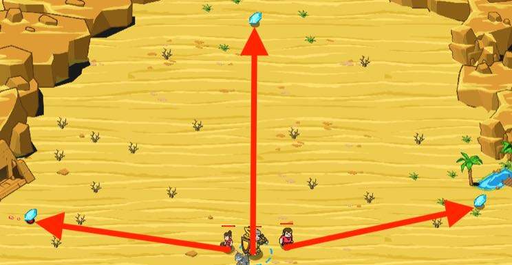

## _Team Work_

#### _Legend says:_
> Three gems, three people, and a deadline.

#### _Goals:_
+ _Collect 3 gems_

#### _Topics:_
+ **Basic Syntax**
+ **Strings**
+ **Variables**
+ **Accessing Properties**
+ **Array Indexes**
+ **Array Indexing**

#### _Solutions:_
+ **[JavaScript](teamWork.js)**
+ **[Python](team_work.py)**

#### _Rewards:_
+ 257 xp
+ 200 gems

#### _Victory words:_
+ _THE POWER OF WORKING TOGETHER!_

___

### _HINTS_

Those gems will dissapear soon. Use peasants and the hero to collect all gems quickly.



`hero.findItems()` returns an array containing all the items your hero can see.

```javascript
var items = hero.findItems();
var first = items[0];  // The first index is 0
var second = items[1];
var third = items[2];
```

When you assign an item to a variable, you can work with it as you did it with the `findNearestItems()` in previous levels.

___

Methods like `findItems`, `findEnemies` and `findFriends` return an array (filled with items, enemies, or friends).

Elements of an array are counted starting from 0, so **the first element of the array has an index of zero**. To get an element of the `array` use the `array[n]` syntax, where `n` is an index of the required element.

```javascript
var enemies = hero.findEnemies();
var firstEnemy = enemies[0];
var secondEnemy = enemies[1];
```

Be careful about the length of the array. If you try to read an index that is greater than or equal to the array's length you can get an error or `undefined` value.

You can assign elements of an array to a variable.

```javascript
var items = hero.findItems();
var firstItem = items[0];
hero.moveXY(firstItem.pos.x, firstItem.pos.y);
```

You can also use array elements without assigning them to a variable:

```javascript
var enemies = hero.findEnemies();
hero.attack(enemies[0]);
```

___
