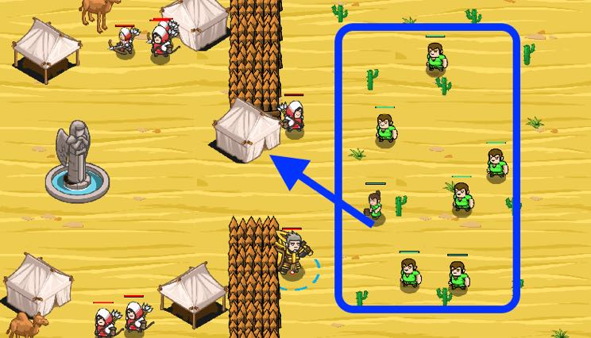

## _Recruiting Queue_

#### _Legend says:_
> Go through the queue one-by-one.

#### _Goals:_
+ _Recruit 10 peasants_

#### _Topics:_
+ **Stringss**
+ **Variables**
+ **While Loops**
+ **Accessing Properties**
+ **Array Indexes**
+ **Array Length**

#### _Solutions:_
+ **[JavaScript](recruitingQueue.js)**
+ **[Python](recruiting_queue.py)**

#### _Rewards:_
+ 257 xp
+ 200 gems

#### _Victory words:_
+ _BATTLE PREPARATIONS COMPLETE!_

___

### _HINTS_



Some peasants want to join the army.

To get the list of neutral peasants, you can use `hero.findEnemies()`.

Then call the first one from that array. To say somebody's name you can use `hero.say(unit)` or `hero.say(unit.id)`.

Because the list of peasants is changing, you should update it on each iteration of the `while-loop`. To update it, just call `findEnemies()`.

Items can appear or be collected. Units might die or be summoned. As a result, arrays from methods like `findItems()`, `findEnemies()` and `findFriends()` can contain **old** data. To avoid the problem, you should update those arrays every loop.

```javascript
var enemies = hero.findEnemies();

while (true) {
    hero.attack(enemies[0]);
    // "enemies" can contain out of date data.
    // Updait it
    enemies = hero.findEnemies();
}
```

___
