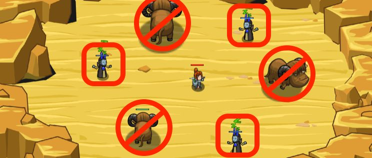

## _Lurkers_

#### _Legend says:_
> Hunt down ogres as they hide among the yaks.

#### _Goals:_
+ _Gently awaken sleeping shamans._

#### _Topics:_
+ **Strings**
+ **Variables**
+ **While Loops with Conditionals**
+ **Accessing Properties**
+ **Array Indexes**
+ **Array Length**

#### _Solutions:_
+ **[JavaScript](lurkers.js)**
+ **[Python](lurkers.py)**

#### _Rewards:_
+ 277 xp
+ 211 gems

#### _Victory words:_
+ _AND THEY THOUGHT THE YAKS MADE THEM INVISIBLE..._

___

### _HINTS_



`findEnemies()` gives you an array containing all enemies your hero can see:

```javascript
var enemies = hero.findEnemies();
```

Loop through all the enemies, and attack any with type `"shaman"`.

Now that you're familiar with arrays, you can use the method `findEnemies()` to get an array containing all the enemies your hero can see.

Notice that the sample code uses another `while` loop to make sure your hero keeps attacking the shaman while it's `health` is greater than `0`!

The logic for which enemies to attack has been provided for you, you need to put it within a `while` loop, where you loop over the `enemies` to find all the `"shaman"`.

```javascript
while (enemyIndex < enemies.length) {
    var enemy = enemies[enemyIndex];
    if (enemy.type == "shaman") {
        while (enemy.health > 0) {
            hero.attack(enemy);
        }
    }
}
```

_**Important**: make sure you increment the `enemyIndex` every time the loop runs, even if the enemy isn't a shaman!_

___
