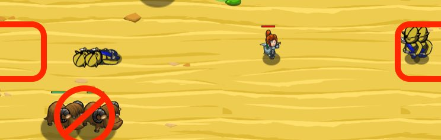

## _Sarven Shepherd_

#### _Legend says:_
> Defend the oasis from waves of raiding ogres!

#### _Goals:_
+ _Defeat the thirsty ogres_

#### _Topics:_
+ **Strings**
+ **Variables**
+ **While Loops**
+ **While Loops with Conditionals**
+ **Accessing Properties**
+ **Array Length**

#### _Solutions:_
+ **[JavaScript](savernShepherd.js)**
+ **[Python](savern_shepherd.py)**

#### _Rewards:_
+ 299 xp
+ 224 gems

#### _Victory words:_
+ _SOMEDAY YOU'LL GET A SHEPHERDING PET TO DO THIS STUFF FOR YOU._

___

### _HINTS_



Use a `while` loop to examine the array of `enemies`. Attack the enemy if it's type isn't `"sand-yak"`!

Use `while` to loop over the array of `enemies`.

```javascript
while (enemyIndex < enemies.length) {
    var enemy = enemies[enemyIndex];
    if (enemy.type != "sand-yak") {
        // Attack while enemy's health > 0
    }
    enemyIndex += 1;
}
```

When attacking, use a `while` loop with the condition `enemy.health` is greater than zero to make sure you attack until the enemy is defeated.

_**Hint**: The `moveXY()` command should be **after** (outside) your `while enemyIndex` loop, but **inside** the main **while-true** loop._

___
