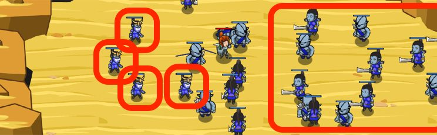

## _Preferential Treatment_

#### _Legend says:_
> Target the most dangerous enemies first to increase your odds of survival.

#### _Goals:_
+ _Mash those ogres_

#### _Topics:_
+ **Strings**
+ **Variables**
+ **While Loops with Conditionals**
+ **Accessing Properties**
+ **Array Length**
+ **Iterating Over Arrays**

#### _Solutions:_
+ **[JavaScript](preferentilTreatment.js)**
+ **[Python](preferential_treatment.py)**

#### _Rewards:_
+ 288 xp
+ 217 gems

#### _Victory words:_
+ _YOU HAVE A FINE TASTE IN TARGETS._

___

### _HINTS_

Throwers do a lot of damage, but have low health.

Before, you could only `findNearestEnemy`. Now, you can use `findEnemies` to find all enemies, and attack the throwers first!

First: `while` loop through all the `enemies` and attack only if `enemy.type` is `"thrower"`.

Second: `while` loop through all the `enemies` again, attacking all of them.

First, use a `while` loop to loop over the `enemies` array, and attack all of the enemies with type `thrower`.

Then, use another `while` loop to loop over a new `enemies` array, to attack the rest of the ogres.

Don't forget to increment the index in your loops!

___
