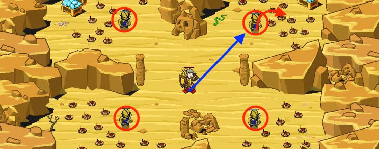

## _Bash 'Em All_

#### _Legend says:_
> The best defense is a good offense (even if you don't have a sword).

#### _Goals:_
+ _Ogres must be defeated_
+ _Collect all gems_

#### _Topics:_
+ **Strings**
+ **Variables**
+ **While Loops with Conditionals**
+ **Accessing Properties**
+ **Array Indexes**
+ **Array Length**

#### _Solutions:_
+ **[JavaScript](bashEmAll.js)**
+ **[Python](bash_em_all.py)**

#### _Rewards:_
+ 190 xp
+ 88 gems

#### _Victory words:_
+ _MAKE THE BAD MAN FLY!_

___

### _HINTS_

Those ogres are really light. But they are strong.

What if we will find a way to push them to the minefields?

One of the obvious ways to solve this level is to use shields' ability `bash`. That skill knockbacks enemies.

Of course it's not the only way to complete this level and you can use knockback weapons or spells. Or just brute force.

___
