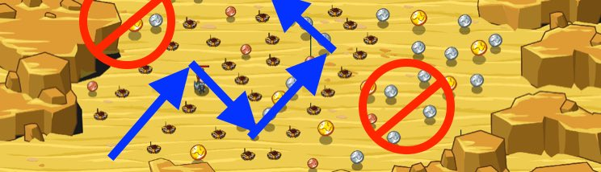

## _Sand Snakes_

#### _Legend says:_
> This desert canyon interferes with your findNearest glasses. You'll have to improvise!

#### _Goals:_
+ _Cross the desert safely_

#### _Topics:_
+ **Variables**
+ **While Loops**
+ **While Loops with Conditionals**
+ **Accessing Properties**
+ **Array Indexes**
+ **Array Length**

#### _Solutions:_
+ **[JavaScript](sandSnakes.js)**
+ **[Python](sand_snakes.py)**

#### _Rewards:_
+ 204 xp
+ 105 gems

#### _Victory words:_
+ _ALL THAT GLITTERS IS NOT GOLD_

___

### _HINTS_

`findNearest` doesn't work on this level.

Use a `while` loop to loop over the objects in an array to find the nearest coin!

The nearest coin is the one with the smallest `distanceTo`.

___

This level teaches you how to loop over an array of items and compare them, in order to find the nearest item.

First we get an array of all the coins with `findItems`. Then we loop over the coins and keep track of two things: `nearest` and `nearestDistance`.

`nearest` is a reference to the nearest coin we have found so far. It starts off as `None` or `null` (depending on your programming language).

`nearestDistance` is the distance to the `nearest` coin. It starts out as a really high number, higher than any of the coins' distance could ever be.

As we loop through the coins, we compare the distance to the current coin to the nearestDistance so far. If it's less, we set `nearest` to be the current coin, and `nearestDistance` to be the current coin's distance.

By the end of the loop, nearest will be the coin with the smallest distance.

In future levels we will use a similar technique to find certain items or enemies based on other information, such as the lowest/highest health, or closest/farthest distance, or even best coin to collect based on it's value and distance!

___
