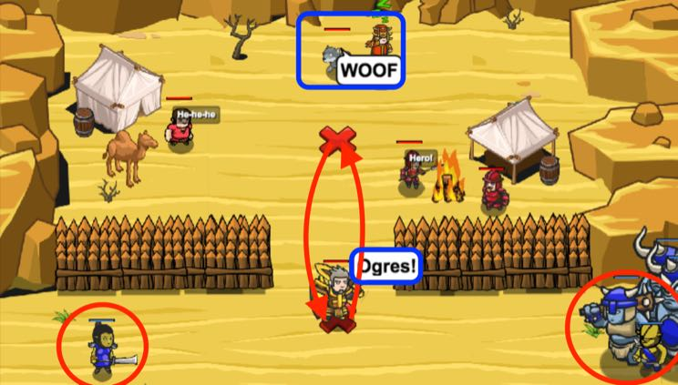

## _Chain of Command_

#### _Legend says:_
> I'm all ears, Master.

#### _Goals:_
+ _Defeat the ogres_
+ _Humans must survive_

#### _Topics:_
+ **Strings**
+ **Variables**
+ **While Loops**
+ **If Statements**
+ **Functions**
+ **Accessing Properties**

#### _Solutions:_
+ **[JavaScript](chainOfCommand.js)**
+ **[Python](chain_of_command.py)**

#### _Rewards:_
+ 190 xp
+ 160 gems

#### _Victory words:_
+ _PETS DO A GREAT JOB RELAYING ORDERS!_

___

### _HINTS_



Event handler functions are given information about the `event` that triggered them.

Inside the pet's `"hear"` event handler, you can check who the pet heard with `event.speaker`:

This way, you can have your pet only respond when the hero speaks:

```javascript
function onHear(event) {
    // Who said that?
    if (event.speaker === hero) {
        // It's the hero!
        pet.say("It's the Master!");
    }
}
pet.on("hear", onHear);
```

Your pet will only respond to `hero.say()`.

If there are ogres, your hero should:
1. `say()` something to alert the pet.
2. Run to the X inside the camp.
3. Run back to the X outside the camp.

___
