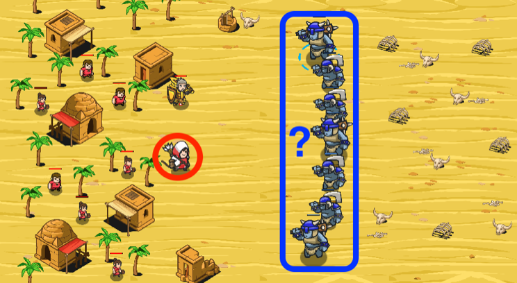

## _Brittle Morale_

#### _Legend says:_
> When the commander falls, the enemy shall retreat.

#### _Goals:_
+ _Defeat the ogre leader_

#### _Topics:_
+ **Variables**
+ **While Loops with Conditionals**
+ **Return Statements**
+ **Accessing Properties**
+ **Array Indexes**
+ **Array Length**

#### _Solutions:_
+ **[JavaScript](battleMorale.js)**
+ **[Python](battle_morale.py)**

#### _Rewards:_
+ 256 xp
+ 191 gems

#### _Victory words:_
+ _YOU BROKE THEIR BONES, AND THEIR SPIRIT!_

___

### _HINTS_



You only have one arrow, so you need to defeat the ogre leader first!

Loop over all the `enemies` and compare their `health`. The one with the most `health` is the boss!

To find the leader ogre, you need to implement a function to find the ogre with the most health.

The function should take in an array containing enemies and should return a single ogre.

Use the `enemy.health` value as the point of comparison.

Remember how to iterate over an array:

```javascript
var array = ["A", "B", "C", "D", "E"];
var index = 0;

while (index < array.length) {
    hero.say(array[index]);  // First the hero says "A", then "B", and so on.
    // Increment the index.
    // This lets you check every index, and adds an end condition for the while loop.
    index += 1;
}

hero.say("That's the ABCs!");
```

___
