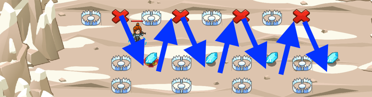

## _Slalom_

#### _Legend says:_
> Step carefully to collect the gems while avoiding traps.

#### _Goals:_
+ _Collect all the gems_

#### _Topics:_
+ **Strings**
+ **Variables**
+ **While Loops with Conditionals**
+ **Accessing Properties**
+ **Array Indexing**
+ **Object Literals**

#### _Solutions:_
+ **[JavaScript](slalom.js)**
+ **[Python](slalom.py)**

#### _Rewards:_
+ 330 xp
+ 163 gems

#### _Victory words:_
+ _SMOOTH MOVES._

___

### _HINTS_



When using `move` you need to construct an object literal to pass as an argument.

You can specify an object literal like this: `pos = { "x": 20, "y": 35 }`.

An object literal is made up of the keys associated with it. For example `pos.x` would return `20` while `pos.y` would return `35`.

___

When using `move`, you may need to construct an **object literal** to pass as its argument.

```javascript
// this is an object literal
var ob = { "x": 20, "y": 35 };
```

Remember that `move` does not block execution of your code? In this level you will use `while` loops to keep moving toward a position while your `pos.x` is less than a certain number.

To move to an X mark, pass an **object literal** to the `move` method.

To move to a gem, use the gem's `pos` object as the argument for `move`.

___
