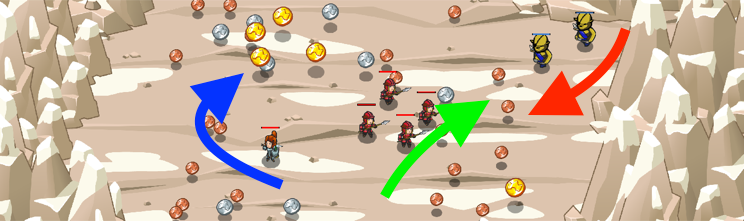

## _Mountain Mercenaries_

#### _Legend says:_
> Raise funds to summon soldiers and survive the ogre onslaught!

#### _Goals:_
+ _Defeat the ogres_

#### _Topics:_
+ **Strings**
+ **Variables**
+ **While Loops**
+ **While Loops with Conditionals**
+ **Accessing Properties**
+ **Array Length**

#### _Solutions:_
+ **[JavaScript](mountainMercenaries.js)**
+ **[Python](mountain_mercenaries.py)**

#### _Rewards:_
+ 371 xp
+ 177 gems

#### _Victory words:_
+ _OK AT YOU, ALL PRESIDENTIAL WITH THE TAXATION AND WAGING OF WAR._

___

### _HINTS_

Use `summon` and `command` to protect yourself while gathering coins.

It's time to practice summoning and commanding soldiers!

The sample code shows you how to use `costOf` to check if you have enough gold to summon a soldier.

If you do, use `summon` to summon a `"soldier"`.

Then, use a `while` loop to loop through the array of `soldiers` and use `command` with `"attack"` to have your soldiers attack any enemies.

The sample code's comments show you how to do this.

___
