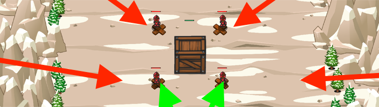

## _Zoo Keeper_

#### _Legend says:_
> Protect the Yeti cage from ogre saboteurs.

#### _Goals:_
+ _Defeat the ogres_
+ _Summon four soldiers_
+ _Protect the cage_

#### _Topics:_
+ **Strings**
+ **Variables**
+ **While Loops**
+ **While Loops with Conditionals**
+ **Iterating Over Arrays**
+ **Assigning Properties**

#### _Solutions:_
+ **[JavaScript](zooKeeper.js)**
+ **[Python](zoo_keeper.py)**

#### _Rewards:_
+ 373 xp
+ 178 gems

#### _Victory words:_
+ _NO YETIS WERE HARMED WHILE MAKING THIS LEVEL_

___

### _HINTS_



Do not let the ogres break open the box!

This level shows how you can use a range of numbers with for loops, to access multiple related arrays.

You also see how to have a soldier defend a certain location.

When collecting coins, you can stop at 80, because each soldier costs 20.

___

A **for-loop** is a different way of writing a loop:

```javascript
for (var i = 0; i < 10; i++) {
    // The hero will count from 0 to 9
    hero.say(i);
}

// This is similar to writing a while loop like:
var i = 0;  // Initializer
while (i < 10) {  // Condition
    // The hero will count from 0 to 9
    hero.say(i);
    i++;  // Final expression
}

// Notice that there are three things in the for loop.
// First, initialize the variable i to be zero.
// Second, the condition of i < 10
// Third, an expression that happens after each loop: i += 1
// You can do all of these steps with a while-loop, but the for-loop is shorter
// and makes sure you don't forget any of the steps.
```

You can use a for loop to iterate over an array of enemies like this:

```javascript
var enemies = hero.findEnemies();
for (var i = 0; i < enemies.length; i++) {
    var enemy = enemies[i];
    hero.attack(enemy);
}
```

___
