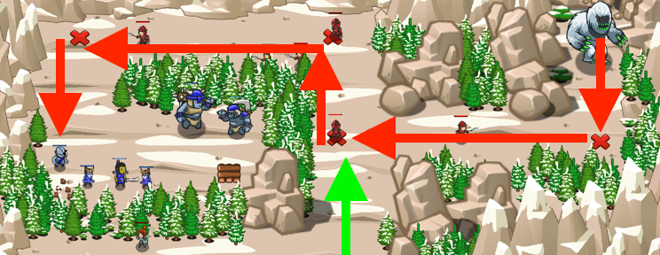

## _Noble Sacrifice_

#### _Legend says:_
> Your soldiers leave a trail of destruction straight to an ogre camp.

#### _Goals:_
+ _Defeat the ogres_
+ _Bonus: Lure the Yeti to the ogre camp_

#### _Topics:_
+ **Strings**
+ **Variables**
+ **While Loops with Conditionals**
+ **Accessing Properties**
+ **Assigning Properties**
+ **Object Literals**

#### _Solutions:_
+ **[JavaScript](nobleSacrifise.js)**
+ **[Python](noble_sacrifice.py)**

#### _Rewards:_
+ 241-360 xp
+ 113-168 gems

#### _Victory words:_
+ _WE HARDLY KNEW YE! YOU WILL NOT BE FORGOTTEN_

___

### _HINTS_



In this level you want to use `for` loops again.

Remember your soldiers fondly.

For this level you'll need a `for` loop:

```javascript
for (var i = 0; i < 4; i++) {
    var friend = friends[i];
    var point = points[i];
}
```

___
