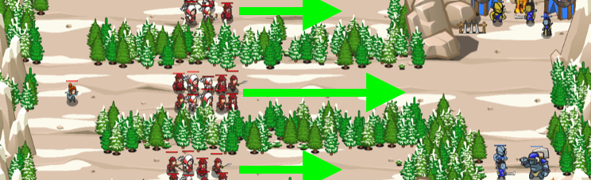

## _Hunting Party_

#### _Legend says:_
> Search the mountains for ogre camps.

#### _Goals:_
+ _Defend the ogres_
+ _Bonus: All your troops survive_

#### _Topics:_
+ **Strings**
+ **Variables**
+ **While Loops**
+ **Array Length**
+ **Object Literals**
+ **Accessing Properties**

#### _Solutions:_
+ **[JavaScript](huntingParty.js)**
+ **[Python](hunting_party.py)**

#### _Rewards:_
+ 245-366 xp
+ 118-176 gems

#### _Victory words:_
+ _SHH, I'M HUNTING OGRES! THE WHOLE IS MORE THAN THE SUM OF ITS PARTS. -- ARISTOTLE_

___

### _HINTS_

Use `findFriends()` and a `for` loop.

Command your troops to advance or attack the ogres!

Use `findFriends()` to get an array of your friends. Then use a `for` loop to give them all commands.

Command them to move to the right (add to the x position) or fight if they see ogres.

_**Hint**: Adding smaller values to the units' x position can limit their speed. This might help your faster units stay in formation with your slower units, which can affect the outcome of a fight._

___
