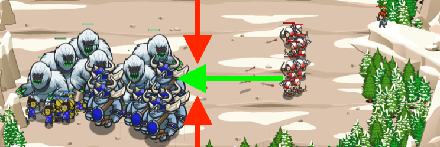

## _Borrowed Sword_

#### _Legend says:_
> What do you do when you find a bunch of ogres fighting a bunch of yeti?

#### _Goals:_
+ _Defend all ogres and yetis_
+ _Some archers must survive_

#### _Topics:_
+ **Strings**
+ **Variables**
+ **While Loops**
+ **Array Indexes**
+ **Array Length**
+ **Accessing Properties**

#### _Solutions:_
+ **[JavaScript](borrowedSword.js)**
+ **[Python](borrowed_sword.py)**

#### _Rewards:_
+ 374 xp
+ 179 gems

#### _Victory words:_
+ _KILL WITH A BORROWED SWORD. -- THIRTY SIX STRATEGEMS_

___

### _HINTS_

Ogres are fighting yeti.

Use a `for` loop to examine the enemies. Command your archers to attack the enemy with the highest `health`!

When that enemy no longer has the highest health, the archers should switch to the new healthiest enemy!

___

Good tactics can turn defeat into victory. In this level, ogres are fighting yeti.

If you do nothing, or if you simply target the closest enemy, one side will win and have enough left to defeat your archers.

Instead, use a for-loop to find the enemy with the highest `health`. Then, `command` your archers to attack that enemy.

_**Hint**: Do not continue attacking the toughest enemy until it has been defeated! You want your archers to constantly switch targets to whichever enemy has the highest health at any given moment! This way, whoever wins (between the yeti and ogres) will be weak enough for your archers to finish off._

___
