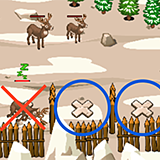

## _Reindeer Spotter_

#### _Legend says:_
> Help the blind herder put the reindeer in their pens by checking arrays.

#### _Goals:_
+ _Call out the empty reindeer pens_

#### _Topics:_
+ **Strings**
+ **Variables**
+ **Array Length**
+ **Object Literals**
+ **Accessing Properties**
+ **Assigning Properties**

#### _Solutions:_
+ **[JavaScript](reindeerSpotter.js)**
+ **[Python](reindeer_spotter.py)**

#### _Rewards:_
+ 259 xp
+ 119 gems

#### _Victory words:_
+ _DOZER, SLEEPY AND RESTFUL ARE NO WHERE TO BE SEEN!_

___

### _HINTS_



Merek the blind reindeer herder wants to put the reindeer down for the night, but he can't tell which pens already have sleeping reindeer in them! 

Use an _array_ to keep track of which pens have reindeer in them and which are free, then tell Merek which spots are open. He'll tell the deer where to go, and then everyone can get some rest.

___

In this level, you will use _arrays_ to keep track of the reindeer. You start with three arrays:
1. An array of positions of the pens that the reindeer will go into.
2. An array that is used to mark which pens have reindeer in them.
3. An array of the reindeer themselves.

The first step is to figure out which reindeer are already in their pens. To do this, loop through the reindeer. For each one, loop through each pen position. If the pen position matches the reindeer's position, it's already there. Use the `penOccupants` array to keep track of which pens have reindeer in them.

After figuring out which pens are occupied, loop through the `penOccupants` array and tell Merek what's in each one. If he hears you say that a pen is `"empty"`, he'll command a reindeer to move into that pen.

If everything goes well, you'll have one reindeer sleeping peacefully in each pen!

By now, you're used to looping over arrays using `while` and `for` loops:

```javascript
for (var i = 0; i < enemies.length; i++) {
    var enemy = enemies[i];
}
```

But you can access any element of an array at any time in any order, as long as it exists:

```javascript
var a = [ null, "one", "two" ];
hero.say(a[1]);  // Says "one"
hero.say(a[2]);  // Says "two"
hero.say(a[0]);  // Says nothing
hero.say(a[3]);  // Error! Array starts at 0 and ends at 2.
```

You can also change the elements of an array however you like:

```javascript
var a = [null, "no", "maybe"];
hero.say(a[1]);  // Says "no"
a[1] = "yes";
hero.say(a[1]);  // Says "yes"
```

You'll need to make a number of changes to the `penOccupants` array to get through this level!

___
