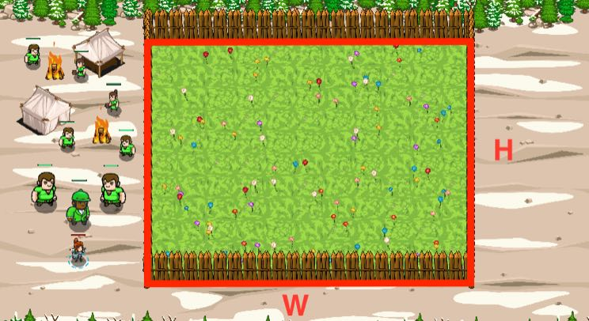

## _How much?_

#### _Legend says:_
> Do you think it's easy to grow the perfect lawn in the mountains?

#### _Goals:_
+ _Pay the fair price for the garden_

#### _Topics:_
+ **Basic Syntax**
+ **Strings**
+ **Variables**
+ **Arithmetic**
+ **Geometry**
+ **Accessing Properties**

#### _Solutions:_
+ **[JavaScript](howMuch.js)**
+ **[Python](how_much.py)**

#### _Rewards:_
+ 387 xp
+ 178 gems

#### _Victory words:_
+ _HOW MUCH DID YOU COMPLETE?_

___

### _HINTS_

The garden is built. It's time to pay the bills. But how much you need to pay?

You need to know how to calculate a perimeter and an area of rectangles.

`perimeter = (width + height) * 2`

`area = width * height`

Perimeter and area are important concepts in Geometry. In everyday life you will often meet those terms, especially regarding rectangles.

1. **Rectangle** is a four-sided shape that is made up of two pairs of parallel lines and that has four right angles
2. **Perimeter** is a path that surrounds a two-dimensional shape.
3. **Area** is the region enclosed by the perimeter of a two-dimensional figure or shape.

___
