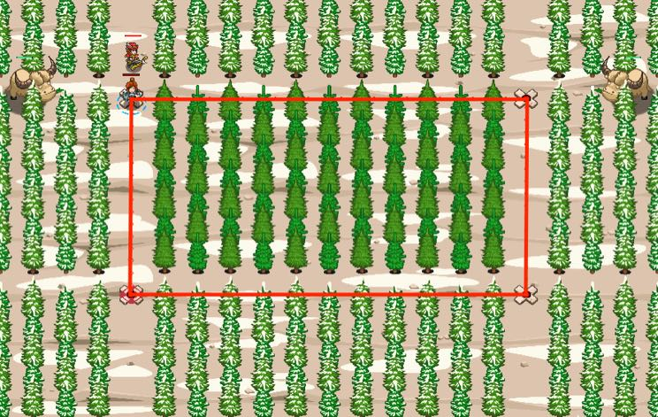

## _Forest Garden_

#### _Legend says:_
> Everything should parallel and perpendicular.

#### _Goals:_
+ _Grow the perfect flower rectangle_

#### _Topics:_
+ **Basic Syntax**
+ **Variables**
+ **Arguments**
+ **Arithmetic**
+ **Accessing Properties**

#### _Solutions:_
+ **[JavaScript](forestGarden.js)**
+ **[Python](forest_garden.py)**

#### _Rewards:_
+ 387 xp
+ 178 gems

#### _Victory words:_
+ _FLOWERY FENCES!_

___

### _HINTS_

This forest would be perfect with a rectangle of flowers.

The rectangle should be perfect. One wrong step and Naria will be angry.

**Don't use _hard-coded_ coordinates (for ex, `moveXY(62, 60)`) because the size of the forest is random.**

Previous levels have covered this topic, so if you have problems, be sure to review past levels!

Also the properties of rectangles can be useful here:
1. The corners of a rectangles share an x or y coordinate with an adjacent corner.
2. Alternate sides are equal.

___
