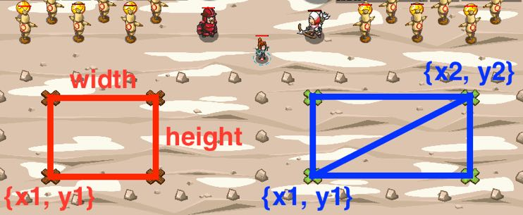

## _Rectangle Formation_

#### _Legend says:_
> Let's start preparations for the parade.

#### _Goals:_
+ _Summon and form up soldiers_
+ _Summon and form up archers_

#### _Topics:_
+ **Strings**
+ **Variables**
+ **Array Length**
+ **Geometry**
+ **Object Literals**
+ **Accessing Properties**

#### _Solutions:_
+ **[JavaScript](rectForm.js)**
+ **[Python](rect_form.py)**

#### _Rewards:_
+ 387 xp
+ 178 gems

#### _Victory words:_
+ _THE PARADE MARCHES ON._

___

### _HINTS_

We need soldiers and archers for the parade. Also, don't forget to form up them in rectangular formations. Sergeants will say which rectangles are required.



However, archers and soldiers are using different methods to describe the rectangles.

___

There are two main methods to describe a rectangle if it's not rotated (sides are parallel to x/y axises):
+ Coordinates of the nearest (0, 0) corner, a width and a height;
+ Coordinates of the nearest and the farthest (0, 0) corners;

For CodeCombat the corner nearest to (0, 0) is the bottom-left corner. Also, there are many variations of those two methods. For example, for the first method, you can use coordinates of the centre instead of the corner or another corner.

Those conventions are easy to convert from one to another:

```
{x: 1, y: 2, width: 10, height: 5}
||
{x1: 1, y1: 2, x2: 1+10, y2: 2+5}

{x1: 4, y1: 3, x2: 13, y2: 8}
||
{x: 4, y: 3, width: 13-4, height: 8-3}
```

___
