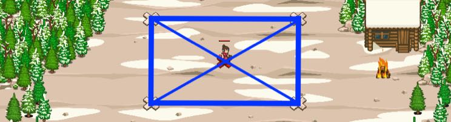

## _Humantron_

#### _Legend says:_
> Humantron is the true combined power of humans.

#### _Goals:_
+ _Defeat the ogres_

#### _Topics:_
+ **Strings**
+ **Variables**
+ **Array Length**
+ **Geometry**
+ **Object Literals**
+ **Accessing Properties**

#### _Solutions:_
+ **[JavaScript](humantron.js)**
+ **[Python](humantron.py)**

#### _Rewards:_
+ 387 xp
+ 178 gems

#### _Victory words:_
+ _BY OUR POWERS COMBINED: WE ARE A BIGGER HUMAN!_

___

### _HINTS_

Ogres think you are in a trap but they don't know about the secret human weapon -- Humantron. Summon 2 archers and 2 soldiers; form a rectangle with the peasant in the center; sit back and enjoy some popcorn while you watch Humantron take out the Ogres.

One of the methods of describing shapes in computer graphics is by using the center coordinates of the shape and additional parameters. This can be useful if you want to use a similar system for all figures (rectangles, circles, triangles etc). Also, this method comes in handy when you want to add a rotation (don't worry we are not at this level yet).

For a rectangle, three parameters are required: coordinates of the centre point, width and height. You can easily compute all of the corners of the rectangle by dividing the width and height by two and adding or subtracting the result from the center point.

___
