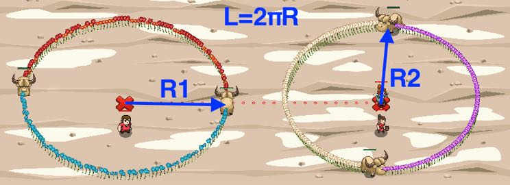

## _Circumference of Yaks_

#### _Legend says:_
> Yaks are like big fur balls.

#### _Goals:_
+ _Calculate the first circumference_
+ _Calculate the second circumference_

#### _Topics:_
+ **Basic Syntax**
+ **Variables**
+ **Arguments**
+ **Arithmetic**
+ **Geometry**
+ **Accessing Properties**

#### _Solutions:_
+ **[JavaScript](circumferenceOfYaks.js)**
+ **[Python](circumference_of_yaks.py)**

#### _Rewards:_
+ 387 xp
+ 178 gems

#### _Victory words:_
+ _THERE IS VALUE IN THE HERD MENTALITY!_

___

### _HINTS_



Help peasants to measure lengths of the yaks' paths. Don't try to cheat them and use math skills.

The length of the circumference is related to the radius `r`:

```
C = 2 * PI * r
where PI ≈ 3.14159 (Use Math.PI)
```

The circumference of a circle is the distance around it. Circumference is a special case of perimeter.

The circumference of a circle relates to one of the most important mathematical constants in all of mathematics. This constant, `pi`, is represented by the Greek letter `π`. The numerical value of `π` is 3.14159 26535 89793 .... Pi is defined as the ratio of a circle's circumference `C` to its diameter `d`:

```
pi = C / d
```

Or, equivalently, as the ratio of the circumference to twice the radius.

```
pi = C / 2 * r
C = 2 * pi * r
```

You don't need to remember the value of `pi`. The most of the programming languages has builtin constants for that.

**You can use `Math.PI` to get the value of `pi`.**

___
